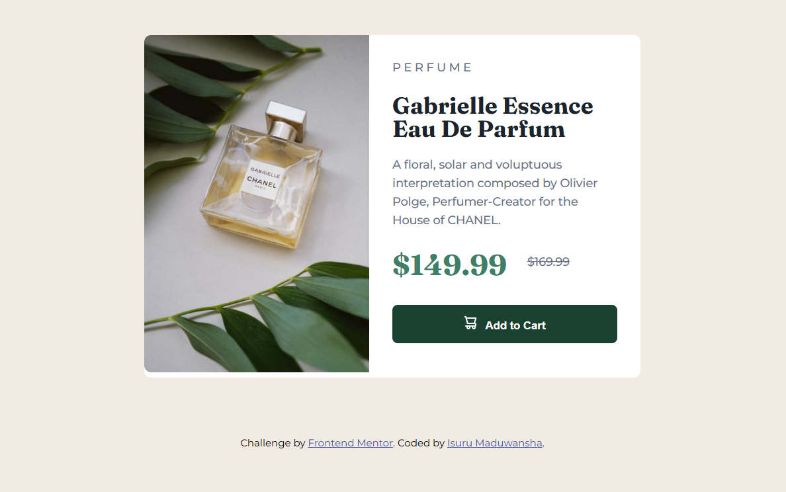

# Frontend Mentor - Product preview card component solution

This is a solution to the [Product preview card component challenge on Frontend Mentor](https://www.frontendmentor.io/challenges/product-preview-card-component-GO7UmttRfa). Frontend Mentor challenges help you improve your coding skills by building realistic projects. 

## Overview

### The challenge

Users should be able to:

- View the optimal layout depending on their device's screen size
- See hover and focus states for interactive elements

### Screenshot



### Links

- Solution URL: [Solution URL here](https://github.com/Isuru-Maduwansha/product-preview-card-challenge)
- Live Site URL: [Live site URL here](https://isuru-maduwansha-product-preview.netlify.app/)

## My process

### Built with

- Semantic HTML5 markup
- CSS custom properties
- Flexbox
- CSS Grid
- Mobile-first workflow

### What I learned

To optimize my website for desktop and mobile, I have used responsive design techniques like media queries to adjust layout based on screen size. Implement responsive images with the srcset attribute, ensuring images scale correctly. This approach enhances user experience across all devices.

```html
<picture>
      <source srcset="./images/image-product-desktop.jpg" media="(min-width: 768px)">
      
    </picture>
```
```css
@media (min-width: 768px) {
  .container {
    flex-direction: row;
    max-width: 600px;
  }

  .gabrielleImg {
    width: 100%;
    border-top-right-radius: 0;
    border-bottom-left-radius: 0.6em;
  }

  .perfumeName {
    width: 100%;
    padding: 2em;
  }
}
```

## Author

- Frontend Mentor - [@Isuru Maduwansha](https://www.frontendmentor.io/profile/Isuru-Maduwansha)
